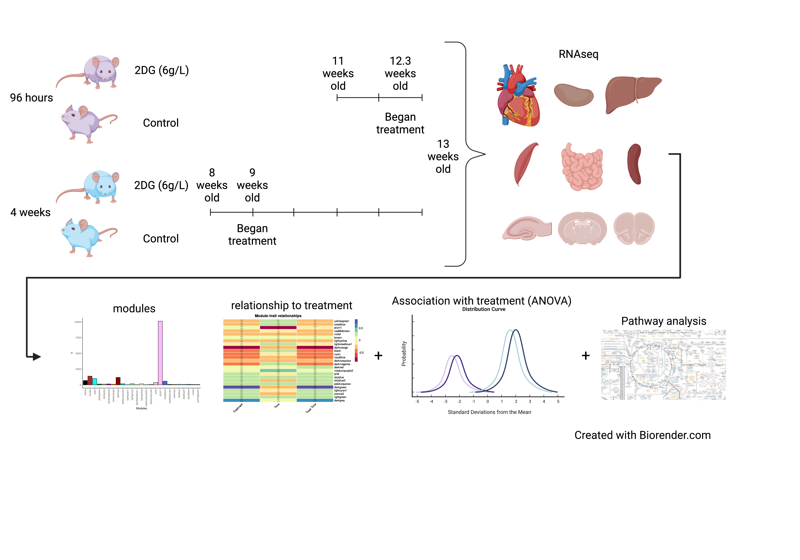

```{r, fig.align='center', echo=FALSE}

```

This website is the cental location for analyses performed by Ann Wells. This website contains the transcriptomics data analysis. A depiction of the experimental design, as well as who is a part of the DIF (Director's Innovation Fund) project is above. The overall experimental design contains 10 male C57BL/6J mice per treatment combination. 10 mice were fed 2-deoxyglucose (2DG) and 10 others acted as a control. Nine tissues (spleen, kidney, skeletal muscle, liver, heart, small intestine (ileum), hippocampus, hypothalamus, and pre-frontal cortex) and serum were taken from each mouse. Two time points were measured (96 hours and 4 weeks) with each set of mice being euthanized after their respective time point. Although there were 10 mice per treatment combination, a subset of these samples was used for each -omic analysis. This information will be found under each -omic header.

For more information or to perform your own subsequent analysis please see the icons in the navigation bar to the right. There you will find the shiny app, which enables you to plot any genes of interest by tissue or treatment; the github repository, which contains the raw code; figshare, which contains the data, and a link to email Dr. Lucas "Chih-Hao" Chang and myself for any follow up questions.

Enjoy!
